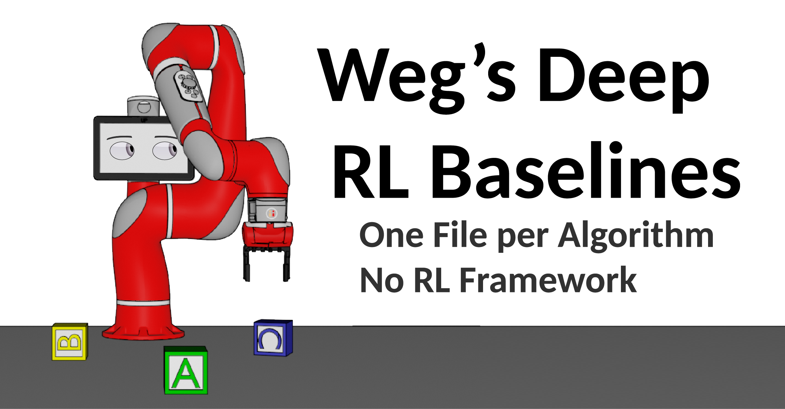

**Status:** Maintenance (expect bug fixes and additional algorithms)

 

# RL Baselines

Weg's RL Baselines is a set of minimum viable implementations of reinforcement learning algorithms.

Most common implementations are overly complex or require more intimate knowledge of a companies internal software pipeline or frameworks. This imposes a real barrier to education in the field of reinforcement learning, where complexity of the algorithms is already a concern on its own.

Anything that would expand the files beyong minimum complexity is not included. 
Anything that would be considered boilerplate is not included. No model saving, loading, or testing. You can easily add those features yourself. 
Itertools and less common tensor operations, numpy, and pytorch features are avoided to make the baselines accessable to the average python programmer.

These algorithms function as a starting point for your own implementations. 
While not distributed implementations, they could be used in production with minimal modification. These implementations include the most commonly used 
drl algorithms, and if hyperparameter tuned, achieve state of the art results in non-reward-sparse continuous control environments.


## Prerequisites 
Baselines requires python3, pytorch, and openai-gym.

### bash
```bash
pip3 install gym
```
This may also be necessary:
```bash
pip3 install gym[box2d]
``` 

## Installation
- Clone the repo and cd into it:
    ```bash
    git clone https://github.com/wegfawefgawefg/wegs-drl-baselines.git
    cd wegs-drl-baselines
    ```

## Running an algo
Most of the algorithms in wegs-baselines repo are used by running the corresponding algorithm file:
```bash
python3 ./dqn.py
```

### Saving and loading the model
Weg's DRL Baselines does not include model saving or loading, as it goes against the intention of the repo to be minimal. However, adding this functionality is [trivial](https://pytorch.org/tutorials/beginner/saving_loading_models.html).

### Logging and Visualization
You can store rewards and losses in a list and shove them into matplotlib or tensorboard.

## Main Algorithms
- [DQN](wegs-drl-baselines/tree/main/dqn)
- [DoubleDQN](wegs-drl-baselines/tree/main/double_dqn)
- [NoisyDQN](wegs-drl-baselines/tree/main/a2c)
- [PERDQN](wegs-drl-baselines/tree/main/a2c)
- [DuelingAC](wegs-drl-baselinestree/main//dueling_ac)
- [AC](wegs-drl-baselines/tree/main/ac)
- [DDPG](wegs-drl-baselines/tree/main/ddpg)
- [TD3](wegs-drl-baselines/tree/main/TD3)
- [PPO1](/ppo)

## ExperimentalAlgorithms
These are complete and functioning, but are not recommended for use in 
making good quality RL bots.
- [BATCH-AC](wegs-drl-baselines/tree/main/batch_actor_critic)
- [AE-WorldModel](wegs-drl-baselinles/tree/main/world_modeling)
